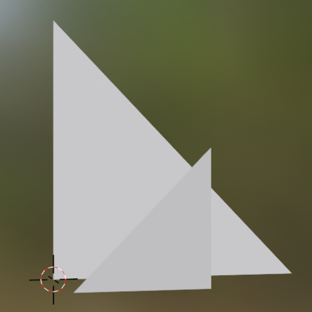

### Test Assets

| Asset                                                     | Screenshot                                                    | Description |
|-----------------------------------------------------------|---------------------------------------------------------------|-------------|
| [Triangles](2triangles)                                   |                      | Simple mesh w/ two triangles. |
| [Emmissive Lightning](emmisiveLight)                      |                   | A simple scene w/ emissive material. Test area lightning. |
| [Parallel Triangles](parallelTriangles)                   |               | Tests if distance between light and surface is taking into account. Light position is on between triangles : (0, 0, 0.5), (0.5, 0.0, 0.5), (0.0, 0.5, 0.5)  |
